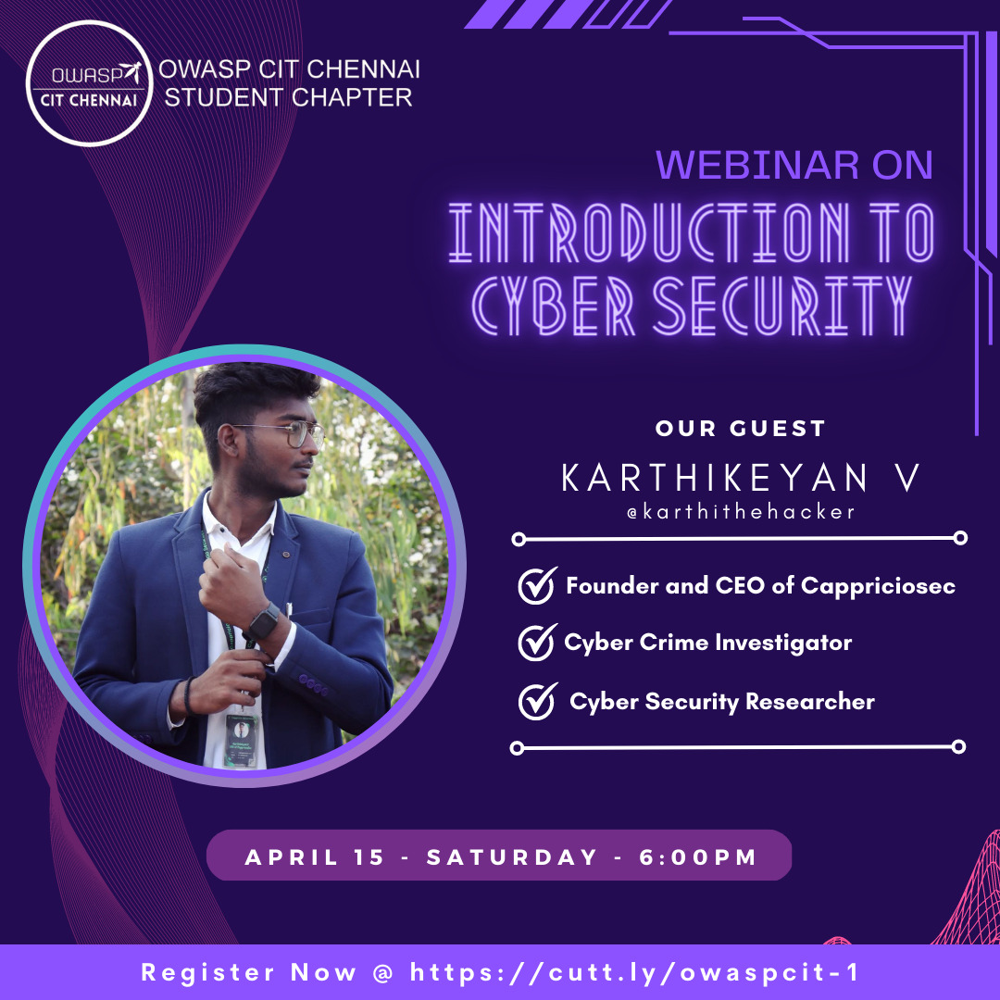

---

layout: col-sidebar
title: OWASP Chennai Institute of Technology
tags: example-tag
region: Asia
meetup-group:

---

<!-- a welcome greeting -->

## Welcome
OWASP Chennai Institute of Technology is a vision and a pulse with tempo to unify the domains precisely shaping our very future. A fusion of expertise, creativity, and innovation with the rhythm of all problems, one solution converging on cybersecurity to solve the world's biggest challenges. This place a power of collaboration in motion is where the impossible becomes possible. 

Gather yourself to embark on our OWASP Chennai Institute of Technology mission to make the digital world a safer place. Unlock a world of opportunities by safeguarding the future with a career in cybersecurity. Never compromise the potential of the dynamic field of cybersecurity. Dive into the world of cybersecurity and make a difference through the deep roots of Web, app and network security with us. 

We Cybersecurity Mavericks walk on the path of independent ideals with a common goal. A bond unbreakable, a team unstoppable building the future, side by side. 
## Participation
The Open Web Application Security Project (OWASP) is a nonprofit foundation that works to improve the security of software. All of our projects ,tools, documents, forums, and chapters are free and open to anyone interested in improving application security. 

Chapters are led by local leaders in accordance with the [Chapters Policy](/www-policy/operational/chapters). Financial contributions should only be made online using the authorized online donation button. 

Everyone is welcome and encouraged to participate in our [Projects](/projects/), [Local Chapters](/chapters/), [Events](/events/), [Online Groups](https://groups.google.com/a/owasp.com/){:target='_blank'}, and [Community Slack Channel](https://owasp.slack.com/){:target='_blank'}. We especially encourage diversity in all our initiatives. OWASP is a fantastic place to learn about application security, to network, and even to build your reputation as an expert. We also encourage you to be [become a member](/membership/) or consider a [donation](/donate/) to support our ongoing work.

Next Meeting/Event <!-- You should keep this section as it will populate your meetup events -->
---------------------


### Register At [Registration Form](https://cutt.ly/owaspcit-1)
### Falicitator : [@karthithehacker](https://www.instagram.com/karthithehacker/)
### Event Location : CHAPTER DISCORD SERVER [discord.gg](https://discord.gg/f2kn45J5Eb)

